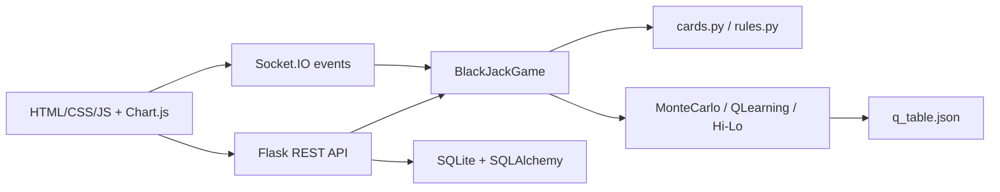

# BlackJack WebApp

Aplicacion web de Blackjack con motor de juego en Python, interfaz Flask, autenticacion, persistencia SQLite, endpoints REST, eventos Socket.IO y estrategias de IA basadas en Monte Carlo, Q-Learning tabular y conteo Hi-Lo.

[](https://github.com/Geovanni-Gonzalez/BlackJack-WebApp/actions/workflows/ci.yml)


## Evidencia tecnica

| Area | Evidencia |
| --- | --- |
| Motor de juego | Reglas, mazo, manos, apuestas, turnos, dealer, split, double down, insurance y cierre de ronda en `app/core/` |
| IA y algoritmos | Monte Carlo sobre zapato restante, Q-Learning tabular persistente en JSON y conteo Hi-Lo en `app/ai/` |
| Backend web | App factory, Blueprints, sesiones Flask, CSRF, rate limiting, REST API y Socket.IO en `app/__init__.py` y `app/web/controllers/` |
| Persistencia | Modelos SQLAlchemy para jugadores, sesiones y leaderboard en `app/data/models.py` |
| Frontend | UI modular con ES modules, Chart.js, Socket.IO client, asesorias de probabilidad y metricas de sesion |
| Calidad | 24 pruebas unitarias pasan para reglas, motor, Monte Carlo, Q-Learning y conteo |

## Arquitectura



## Stack

| Categoria | Tecnologias |
| --- | --- |
| Lenguajes | Python, JavaScript, HTML, CSS |
| Backend | Flask, Flask-SQLAlchemy, Flask-Session, Flask-WTF, Flask-Limiter |
| Tiempo real | Flask-SocketIO, Socket.IO client, eventlet |
| Datos/IA | Q-Learning, Monte Carlo, conteo Hi-Lo, JSON, SQLite |
| Frontend | ES modules, Fetch API, Chart.js |
| Calidad/DevOps | pytest, compileall, GitHub Actions, Docker, Docker Compose |

## Verificacion local

Ejecutado el 2026-07-16:

```bash
python -m compileall app.py app tests
.venv\Scripts\python.exe -m pytest -q
```

Resultado: `24 passed`.

Nota: la instalacion completa de `requirements.txt` fue intentada, pero fallo por timeout descargando paquetes grandes. Para validar la suite actual se instalo `pytest` en `.venv`; las pruebas existentes no requieren Flask.

## Ejecucion

```bash
python -m venv .venv
.venv\Scripts\python.exe -m pip install -r requirements.txt
.venv\Scripts\python.exe app.py
```

Variables recomendadas:

| Variable | Uso |
| --- | --- |
| `APP_ENV` | `development` o `production` |
| `SECRET_KEY` | Obligatoria en produccion |
| `DATABASE_URL` | URI SQLAlchemy; por defecto usa SQLite |

## Documentacion

| Documento | Proposito |
| --- | --- |
| `TECHNICAL_REVIEW.md` | Evaluacion tecnica, arquitectura, cumplimiento, riesgos y verificacion |
| `CV_EVIDENCE.md` | Evidencia reutilizable para Master Resume, LinkedIn y entrevistas |
| `IMPROVEMENT_ROADMAP.md` | Backlog priorizado para aumentar valor profesional |
| `PROJECT_DOCUMENTATION.md` | Documento academico previo del proyecto |
