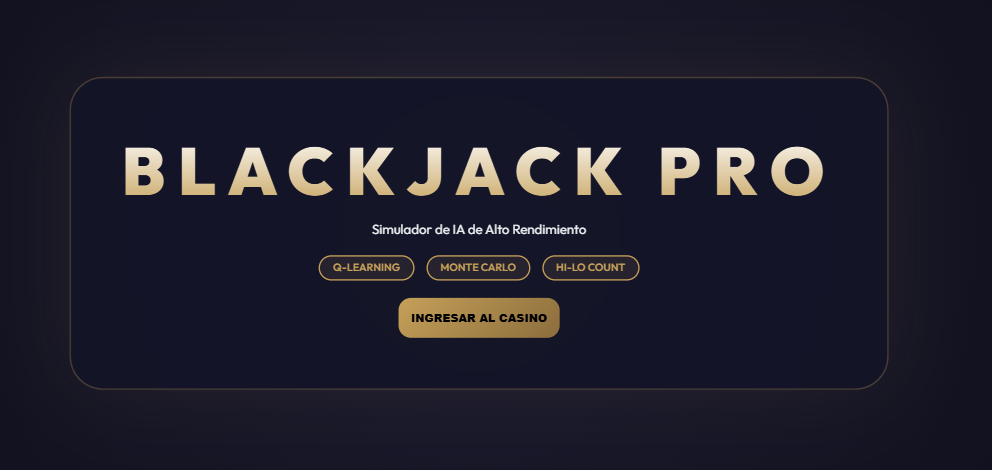

# BlackJack WebApp

## Descripción
Aplicación web de Blackjack con Flask, sesiones, autenticación, lógica de juego y módulos de IA como Q-Learning, Monte Carlo y conteo.

## Objetivo
Practicar desarrollo web con Python, reglas de juego, persistencia y algoritmos de decision.

## Tecnologías utilizadas
- Python
- Flask
- Flask-SocketIO
- SQLite
- HTML/CSS/JavaScript
- Pytest

## Funcionalidades principales
- Juego web
- Autenticación y paneles
- API/controladores
- Core de cartas/reglas/salas
- IA y pruebas

## Mi rol
Desarrollé arquitectura Flask, lógica central, controladores y pruebas.

## Aprendizajes clave
- Estructura Flask
- Reglas de cartas
- SQLite y sesiones
- Pytest
- IA aplicada

## Instalación y ejecución
```bash
cd BlackJack-WebApp
python -m venv .venv
.venv\Scripts\activate
pip install -r requirements.txt
python app.py
pytest
```

## Estructura del proyecto
- app.py: entrada
- app/core/: reglas
- app/web/: controladores/templates/static
- app/ai/: estrategias
- tests/: pruebas

## Capturas o demo


## Estado del proyecto
Proyecto funcional con base experimental de IA.

## Valor técnico demostrado
Demuestra desarrollo Flask, capas, pruebas y algoritmos sobre un dominio interactivo.

## Mejoras futuras
- Documentar variables de entorno
- Limpiar sesiones generadas
- Agregar Docker

## Autor
Geovanni González  
Estudiante de Ingeniería en Computación  
GitHub: [Geovanni-Gonzalez](https://github.com/Geovanni-Gonzalez)


