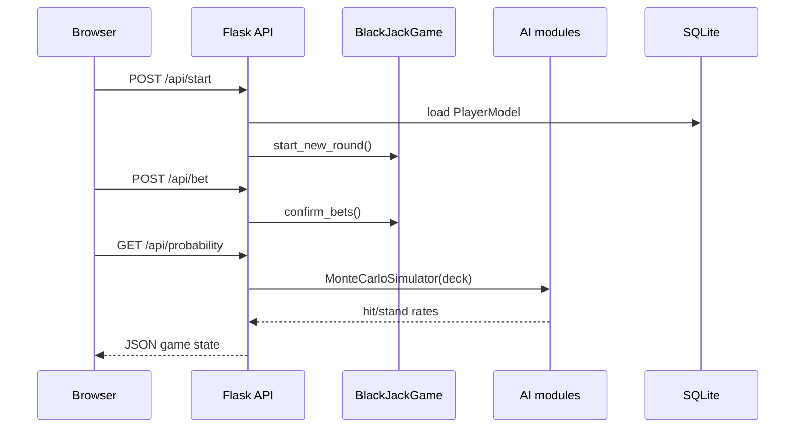

# Technical Review

Fecha de revision: 2026-07-16  
Repositorio: `BlackJack-WebApp`  
Metodo: analisis estatico de codigo, documentacion local, configuracion, historial Git disponible y verificacion con `compileall` + `pytest`.

## 1. Comprension del proyecto

| Aspecto | Resumen |
| --- | --- |
| Problema | Simular partidas de Blackjack y comparar decisiones humanas/IA con estrategias probabilisticas. |
| Objetivo | Integrar un motor de Blackjack con IA, metricas academicas, interfaz web y persistencia basica. |
| Alcance | Juego web autenticado, partidas single-player con IA, soporte inicial multijugador por Socket.IO, entrenamiento Q-Learning y dashboard. |
| Usuarios | Estudiante/desarrollador, jugador autenticado, evaluador tecnico del curso IC-3002. |
| Funciones principales | Apuestas, hit, stand, double down, split, insurance, withdraw, leaderboard, Monte Carlo, Q-Learning, Hi-Lo, metricas y visualizacion. |

No se encontro un enunciado formal separado. La validacion usa `PROJECT_DOCUMENTATION.md`, `project-info.json`, UI y codigo como fuentes de requerimientos inferidos.

## 2. Matriz de cumplimiento

| Requisito | Estado | Evidencia |
| --- | --- | --- |
| Motor de Blackjack con reglas basicas | ✅ Implementado | `BlackJackGame` gestiona rondas, turnos y resultados (`app/core/game.py:92`, `app/core/game.py:122`, `app/core/game.py:402`); reglas de valor y bust en `app/core/rules.py`. |
| Manejo de As | ✅ Implementado | `calculate_hand_value` degrada As de 11 a 1 cuando evita bust; probado en `tests/test_rules.py`. |
| Apuestas y balance | ✅ Implementado | `Hand.place_bet`, `double_bet` y payouts en `determine_winners` (`app/core/game.py:47`, `app/core/game.py:53`, `app/core/game.py:402`). |
| Acciones Hit/Stand | ✅ Implementado | API `/hit` y `/stand` llaman `player_hit`/`player_stand` (`app/web/controllers/api.py:77`, `app/web/controllers/api.py:85`; `app/core/game.py:284`). |
| Double down | ✅ Implementado | `player_double_down` valida dos cartas y saldo (`app/core/game.py:198`); ruta `/double` (`app/web/controllers/api.py:93`). |
| Split | 🟡 Parcial | `player_split` crea una segunda mano (`app/core/game.py:213`), pero no hay pruebas dedicadas ni validacion completa de casos edge. |
| Insurance | 🟡 Parcial | `player_insurance` existe (`app/core/game.py:246`) y ruta `/insurance` (`app/web/controllers/api.py:109`); falta cobertura de pruebas. |
| Withdraw | ✅ Implementado | `player_withdraw` y `/withdraw` (`app/core/game.py:323`, `app/web/controllers/api.py:117`). |
| IA Monte Carlo | ✅ Implementado | `MonteCarloSimulator` usa cartas reales y zapato restante (`app/ai/montecarlo.py:23`, `app/ai/montecarlo.py:29`, `app/ai/montecarlo.py:49`). |
| Q-Learning tabular | ✅ Implementado | `QLearningAgent` con `q_table`, epsilon-greedy, update y persistencia JSON (`app/ai/qlearning.py:6`, `app/ai/qlearning.py:70`, `app/ai/qlearning.py:84`). |
| Entrenamiento de IA | ✅ Implementado | `train()` ejecuta episodios y `start_training` emite progreso por Socket.IO (`app/ai/qlearning.py:100`, `app/web/controllers/sockets.py:104`). |
| Conteo Hi-Lo | ✅ Implementado | `CardCounter.update`, true count y sugerencia (`app/ai/counter.py:3`, `app/ai/counter.py:12`, `app/ai/counter.py:27`). |
| Dificultades IA | ✅ Implementado | `ai_turn` diferencia EASY, MEDIUM y HARD (`app/core/game.py:329`). |
| App Flask modular | ✅ Implementado | App factory, Blueprints, sesiones, CSRF, limiter y SQLAlchemy (`app/__init__.py:1`, `app/__init__.py:24`, `app/__init__.py:39`). |
| Autenticacion | ✅ Implementado | Registro/login con hash Werkzeug y Flask-WTF (`app/web/controllers/auth.py`, `app/web/forms.py`). |
| Persistencia SQLite | ✅ Implementado | `PlayerModel`, `GameSession`, `Leaderboard` (`app/data/models.py:6`, `app/data/models.py:14`, `app/data/models.py:24`). |
| Leaderboard | ✅ Implementado | Endpoints GET/POST y serializacion (`app/web/controllers/api.py:186`, `app/web/controllers/api.py:191`, `app/data/models.py:35`). |
| REST API | ✅ Implementado | Rutas `/api/start`, `/bet`, `/probability`, `/qvalues`, `/strategy/*` (`app/web/controllers/api.py:34`). |
| WebSockets/multijugador | 🟡 Parcial | Eventos de lobby y acciones existen (`app/web/controllers/sockets.py:9`, `app/web/controllers/sockets.py:37`); `room_manager.py` contiene comentarios que indican simplificaciones de lobby y limpieza incompleta. |
| Dashboard de entrenamiento | 🟡 Parcial | Entrenamiento por socket real; heatmap del dashboard es mock aleatorio en `dashboard.html` aunque existe endpoint real `/strategy/heatmap`. |
| CI/CD | ✅ Implementado | GitHub Actions compila y ejecuta pytest (`.github/workflows/ci.yml`). |
| Docker | ✅ Implementado | `Dockerfile` y `docker-compose.yml` con `APP_ENV=production`, `SECRET_KEY` y SQLite persistido. |
| Pruebas automatizadas | ✅ Implementado | 24 pruebas pasan para core/IA; faltan pruebas web, auth, DB, Socket.IO y frontend. |

## 3. Nivel de completitud por area

| Area | Peso | Cumplimiento | Justificacion |
| --- | ---: | ---: | --- |
| Funcionalidades obligatorias | 30% | 82% | Motor, acciones principales, IA y persistencia existen; split/insurance/multijugador requieren mas cobertura. |
| Funcionalidades opcionales | 15% | 68% | Dashboard, leaderboard, themes, Docker y entrenamiento agregan valor; heatmap mock y autopilot incompleto reducen confianza. |
| Calidad tecnica | 20% | 74% | Separacion por capas y factories; hay acoplamiento por sesiones pickled y singletons globales. |
| Documentacion | 10% | 78% | README/review/evidencia/roadmap actualizados; documentacion previa tenia afirmaciones visuales no verificadas. |
| Pruebas | 15% | 62% | 24 pruebas pasan, pero cubren principalmente core/IA. |
| Mantenibilidad | 10% | 70% | Estructura clara; frontend mezcla funciones globales, modulos ES y scripts legacy. |

## 4. Arquitectura

Arquitectura predominante: aplicacion Flask modular por capas.

| Modulo | Responsabilidad |
| --- | --- |
| `app/core` | Dominio del Blackjack: cartas, reglas, manos, turnos, rondas y salas. |
| `app/ai` | Estrategias de decision: Q-Learning, Monte Carlo, conteo y factories. |
| `app/web/controllers` | Controladores Flask REST, auth, vistas y Socket.IO. |
| `app/data` | Modelos SQLAlchemy y persistencia. |
| `app/web/static` | Cliente JS, UI, Socket.IO client, temas y UX. |
| `tests` | Pruebas unitarias de reglas, core e IA. |

## 5. Tecnologias identificadas

| Tipo | Tecnologia / formato |
| --- | --- |
| Lenguajes | Python, JavaScript, HTML, CSS |
| Frameworks | Flask, Flask-SocketIO, Flask-SQLAlchemy, Flask-WTF, Flask-Session, Flask-Limiter |
| Librerias frontend | Chart.js, Socket.IO client, Fetch API |
| IA/algoritmos | Q-Learning tabular, Monte Carlo, Hi-Lo |
| Datos | SQLite, SQLAlchemy ORM, JSON (`q_table.json`) |
| Seguridad | CSRF, password hashing Werkzeug, rate limiting, `SECRET_KEY` por entorno |
| Build/dev | `requirements.txt`, `pyproject.toml`, pytest, compileall |
| DevOps | Docker, Docker Compose, GitHub Actions |
| Protocolos | HTTP/JSON, WebSocket/Socket.IO |

## 6. Conceptos tecnicos

| Concepto | Evidencia | Proposito | Valor tecnico |
| --- | --- | --- | --- |
| POO | `Card`, `Deck`, `Hand`, `BlackJackGame`, `QLearningAgent` | Modelar dominio y algoritmos | Facilita pruebas y separacion de responsabilidades. |
| Arquitectura por capas | `core`, `ai`, `data`, `web` | Separar dominio, IA, persistencia y transporte | Mejora mantenibilidad. |
| App Factory | `create_app()` | Inicializar extensiones y blueprints | Patron Flask escalable. |
| REST | Rutas `/api/*` | Exponer acciones y estado del juego | Permite UI desacoplada por JSON. |
| WebSockets | Eventos `create_room`, `hit`, `start_training` | Actualizaciones y entrenamiento en tiempo real | Base para multijugador y streaming de progreso. |
| ORM | Modelos SQLAlchemy | Persistir usuarios y leaderboard | Evita SQL manual. |
| Reinforcement Learning | `QLearningAgent.learn/train` | Aprender politica hit/stand | Evidencia IA aplicada, nivel tabular. |
| Simulacion estocastica | Monte Carlo | Estimar probabilidad de victoria | Conecta decision con probabilidad empirica. |
| Persistencia de modelo | `q_table.json` | Reutilizar Q-table | Estado de aprendizaje entre ejecuciones. |
| Testing | `tests/*.py` | Validar reglas/core/IA | Reduce regresiones en logica central. |
| CI | `.github/workflows/ci.yml` | Compilar y probar en push/PR | Higiene de repositorio profesional. |

## 7. Algoritmos y estructuras de datos

| Elemento | Evidencia | Complejidad / nota |
| --- | --- | --- |
| Calculo de valor de mano | `calculate_hand_value` | O(n) sobre cartas; ajusta As con bucle por cantidad de ases. |
| Mazo | Lista de `Card` con `random.shuffle` y `pop` | Barajado O(n); reparto O(1) amortizado. |
| Monte Carlo | `_simulate` repite `num_simulations` completando dealer | O(S * C), S simulaciones y C cartas consumidas por simulacion. |
| Q-table | Diccionario `(player_value, dealer_value, count_state) -> [stand, hit]` | Lookup/update promedio O(1). |
| Epsilon-greedy | `choose_action` | Balance exploracion/explotacion simple. |
| Hi-Lo | Contador incremental | O(1) por carta. |
| Leaderboard | Query ordenada por `peak_balance` | Depende de DB; no se observa indice explicito. |

## 8. Calidad tecnica

### Fortalezas

| Hecho | Evidencia |
| --- | --- |
| Separacion razonable de dominio, IA, web y datos | Estructura `app/core`, `app/ai`, `app/web`, `app/data`. |
| Motor verificable sin Flask | Pruebas directas sobre `BlackJackGame`, reglas y algoritmos. |
| IA integrada en decisiones y asesorias | `ai_turn`, `/probability`, `/qvalues`, `/strategy/*`. |
| Configuracion sensible a entorno | `ProductionConfig` exige `SECRET_KEY`. |
| CI y Docker disponibles | `.github/workflows/ci.yml`, `Dockerfile`, `docker-compose.yml`. |

### Debilidades y riesgos

| Riesgo | Evidencia | Impacto |
| --- | --- | --- |
| Multijugador incompleto | Comentarios en `room_manager.py` sobre lobby simplificado y limpieza pendiente | Puede fallar en escenarios reales de sala, desconexion o varias rondas. |
| Frontend con funciones globales no definidas en el modulo principal | `resetToBetting()` usado en `index.html`; `current_state` usado en `ux-enhancements.js` | Riesgo de errores JS en flujos de UI. |
| Heatmap del dashboard no usa endpoint real | `dashboard.html` genera `Math.random()` | La visualizacion puede comunicar datos falsos. |
| Cobertura web insuficiente | No hay tests para Flask routes, auth, DB, Socket.IO ni JS | Regresiones posibles fuera del core. |
| Dependencias pesadas no usadas claramente | `numpy`, `pandas`, `matplotlib` en `requirements.txt` sin imports relevantes observados | Aumenta instalacion y superficie de mantenimiento. |
| Sesion Flask almacena objeto de juego | `session['game'] = BlackJackGame()` | Puede dificultar escalado horizontal y compatibilidad de serializacion. |

## 9. Verificacion

| Comando | Resultado |
| --- | --- |
| `python -m compileall app.py app tests` | Exitoso. |
| `.venv\Scripts\python.exe -m pytest -q` | `24 passed`. |
| `.venv\Scripts\python.exe -m pip install -r requirements.txt` | Fallo por timeout descargando `numpy`; no invalida pruebas unitarias actuales. |

Partes verificadas por ejecucion: sintaxis Python, reglas, core, Monte Carlo, Q-Learning y contador.  
Partes verificadas solo por analisis estatico: Flask app runtime, autenticacion, DB, Socket.IO, Docker, GitHub Actions y frontend.

## 10. Evidencia profesional

| Evidencia | Competencia demostrada | Evidencia en codigo | Nivel de profundidad |
| --- | --- | --- | --- |
| Motor de Blackjack desacoplado | Modelado de dominio y POO | `BlackJackGame`, `Hand`, `Deck`, `rules.py` | Python nivel 3: clases, composicion, modulos. |
| Monte Carlo con zapato restante | Simulacion probabilistica aplicada | `app/ai/montecarlo.py:29`, `app/ai/montecarlo.py:49` | Algoritmos nivel 3: simulacion estocastica parametrizada. |
| Q-Learning tabular persistente | RL basico aplicado a decisiones | `app/ai/qlearning.py:6`, `app/ai/qlearning.py:84`, `q_table.json` | IA nivel 2: RL tabular, no redes neuronales. |
| Conteo Hi-Lo | Algoritmo incremental de estado | `app/ai/counter.py:12` | Algoritmos nivel 2: actualizacion O(1). |
| Backend Flask modular | Arquitectura web | `create_app`, Blueprints, extensiones | Backend nivel 3: app factory + REST + ORM. |
| Tiempo real | Eventos Socket.IO | `app/web/controllers/sockets.py` | Web realtime nivel 2: eventos basicos, no escalado distribuido. |
| Persistencia | SQLAlchemy models | `PlayerModel`, `Leaderboard` | DB nivel 2: ORM CRUD basico. |
| Automatizacion de calidad | CI + pytest | `.github/workflows/ci.yml`, `tests/` | DevOps nivel 2: pipeline basico. |

### Que aporta este repositorio

| Pregunta | Respuesta |
| --- | --- |
| Evidencia nueva | Integra juego, IA probabilistica, RL tabular, REST, WebSockets, persistencia y CI en una aplicacion completa. |
| Habilidad mejor demostrada | Capacidad de convertir algoritmos academicos en features web observables. |
| Diferenciador | No es solo CRUD: tiene motor de decision, simulacion, estado de juego y metricas. |
| Recuerdo para reclutador | Proyecto full-stack academico con algoritmos aplicados y pruebas reales del nucleo. |

## 11. Evaluacion final

1. **Impresion en cinco minutos:** proyecto ambicioso y modular; el valor tecnico aparece rapido, pero el frontend y multijugador muestran deuda visible.
2. **Tres aspectos memorables:** IA aplicada a Blackjack; backend Flask por capas; pruebas/CI para motor y algoritmos.
3. **Fortalezas inmediatas:** estructura clara, algoritmos reales, persistencia, autenticacion, Docker/CI.
4. **Debilidades para entrevista:** heatmap mock, funciones JS potencialmente rotas, falta de pruebas de rutas/auth/Socket.IO.
5. **Mejoras de mayor valor curricular:** probar endpoints Flask, reemplazar heatmap mock, completar multijugador, depurar dependencias.
6. **Master Resume obligatorio:** Flask app factory, REST, Socket.IO, SQLAlchemy, Q-Learning tabular, Monte Carlo, Hi-Lo, pytest, CI, Docker.
7. **Nivel demostrado:** Junior+ hacia Mid en backend/arquitectura de proyecto. Justificacion: integra varias capas y algoritmos con pruebas, pero aun tiene deuda de frontend, cobertura parcial y multijugador incompleto.

### Aporte curricular por area

| Area | Puntuacion | Justificacion |
| --- | ---: | --- |
| Ingenieria de Software | 7/10 | Modularidad, pruebas, CI, Docker y documentacion tecnica. |
| Backend | 7/10 | Flask, REST, auth, sesiones, ORM y config por entorno. |
| Frontend | 5/10 | UI amplia con JS modular parcial, pero con deuda de globals y mocks. |
| Ciencia de Datos | 3/10 | Simulacion y metricas; no hay analisis estadistico avanzado ni datasets. |
| IA | 5/10 | Q-Learning tabular y Monte Carlo; no hay modelos avanzados ni evaluacion robusta. |
| Arquitectura | 6/10 | Capas claras y app factory; falta robustez para escalado y estado distribuido. |
| DevOps | 5/10 | CI y Docker basicos; no hay despliegue, observabilidad ni versionado de releases. |

---

## Adenda de verificacion (pasada 2026-07-16, tarde)

- ✅ Re-verificado por ejecucion: `pytest` sobre `tests/` → **24/24 pasan** (core, rules, montecarlo, qlearning, counter).
- ⛔→✅ Higiene corregida: 4 archivos de sesion en `flask_session/` estaban trackeados en git pese a figurar en `.gitignore` (agregados antes de la exclusion). Se aplico `git rm -r --cached flask_session` — pendiente de commit.
- `instance/blackjack.db` y `.pytest_cache/` verificados como NO trackeados.
- `q_table.json` permanece versionado de forma intencional (artefacto de modelo referenciado por el README).
